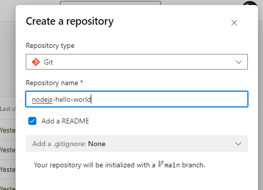

# DevMatch engineering challenges
The DevMatch platform helps you to host short (1-hour) engineering challenges. These challenges are meant to be representative of day to day activities of a software engineer. There are [plenty of examples](https://www.trytapioca.com/library-of-assessments) of these challenges out there that you can borrow inspiration from. 

DevMatch grabs concepts from competitive programming. You provide a statement to the participant and sometimes a starting point, like a pre-existing code repository. Then, the user changes the code or creates code from scratch that is submitted to DevMatch. DevMatch then runs the **evaluator**, which scores the solution based on pre-defined **test cases**. The test cases are returned to the user as a submission score.

# Quick start

The evaluator needs to be written in JavaScript that runs on node.js.  In this short example we will create a simple DevMatch assessment.

Clone or download [this](https://github.com/DevMatch/DevMatch-SDK) repo: 
```
git clone git@github.com:DevMatch/DevMatch-SDK.git
```
or 
```
git clone https://github.com/DevMatch/DevMatch-SDK.git
```

Go to the folder and install the dependencies in the `validator` folder.

```
cd DevMatch-SDK\validator
npm install
```

Open `validator\src\validator.ts` and change the `getProblemStatement` function to be something different.

After you are done, you need to run the publishing process with this command. This command will transpile the typescript into javascript, and pack the contents of your problem into something that DevMatch can take. Every update you make to the source code requires you to re-publish.
```
npm run publish
```
Go to the [explore](https://app.devmatch.io/explore) section of DevMatch and click 'Create Problem'. Provide a title, and description and click 'Create'. You are now editing this problem, now you can provide the validator code.


The output of your publishing step will be inside the dist folder, and it will be called `dist\main-bundle.js`. Take this entire file and past its contents in the code section of the problem you created.


This will automatically generate the statement. Now you can find this problem in the explore page, and open it, and send a submission.

# Creating a challenge
<!--
::: mermaid
sequenceDiagram
    autonumber
    actor User
    participant DevMatch
    participant Challenge
    User->>DevMatch: Open Problem
    DevMatch->>Challenge: Open Problem
    Note right of Challenge: prerequisites()
    Note right of Challenge: openProblem()
    Note right of Challenge: getProblemStatement()
    Challenge->>DevMatch: Statement
    DevMatch->>User: Statement
    loop SolveProblem
        User->>DevMatch: Submit
        DevMatch->>Challenge: Submit
        Note right of Challenge: getTestCase()
        Note right of Challenge: validate()
        Challenge->>DevMatch: Test cases
        DevMatch->>User: Test cases
    end
:::
-->

You need to define the following:

* An introduction that is 255 characters long.
* A statement.
* A time limit, less than 1 hour.
* A validator.

## Prepare
* Get the job description if you have it
* Get external source code and make sure you can run it
* Search online for sample take homes
* Define skills to assess
* Define the test cases

## Design the technical implications
  * Consider the verification mechanism. Unit tests? UI tests? Which framework?
  * Remove the boilerplate
  * Remove the external dependencies

##  Implement the verification
  * Insert testing framework
  * Write test cases
  * Write the CI pipeline if running in CI/CD build. This also includes publishing artifacts.
  * Write the DevMatch validator
  * put in source code version control

## Integrate with DevMatch
  * Make the UTs output a json that DevMatch can read

# Example

In this example we will create a challenge that asks a user to create a CLI tool. This tool will take two integers as arguments and print the sum of the two arguments. It should handle bad input such as non integers or the number of arguments.

* Prepare
  * There is no specific job description for this challenge.
  * We don't want to give the user any starting boilerplate code.
  * Pending.
  * The skills that we want to assess with this challange are: command line tools, nodejs, basic input output.
  * Some test cases include adding two integers, negative numbers, zero arguments, one argument, three arguments.
* Design
  * I will find a testing framework for CLIs
* Implementation.


## Other considerations

* Installation of dependencies require resources out of the package managers main database?
* For example, installing `dynamodb-local` requires a download from AWS servers, the binary is not in NPM 

## Considerations on using CI
DevMatch can use traditional CI/CD builds to run validators. DevMatch will need to:

* Trigger a build. This means that the definition (usually Yaml) has already been created.
* Add metadata to the build instance; this will be the DevMatch build id.
* Continuously query the state of a given build by ID.
* Fetch artifacts from a finished build.

# Latest

Clone the DevMatch SDK:
```bash
git clone https://github.com/DevMatch/DevMatch-SDK.git
```

Install the dependencies:
```bash
cd DevMatch-SDK\validator && npm i
```

Create a new repository somehwere, I am going to use the DevMatch internal repo:


I called this repo `nodejs-hello-world`.

We can modify the readme to add some initial instructions. 

We need to create a validator, or just an integration test that will validate our CLI tool.

In this case, I will use `jest`. I created a `.devmatch` folder where I will keep the test cases "secret".

I installed jest:

```
npm install --save-dev jest
```


# Resources

https://github.com/alexgurr/node-coding-challenges