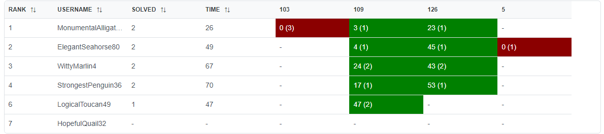
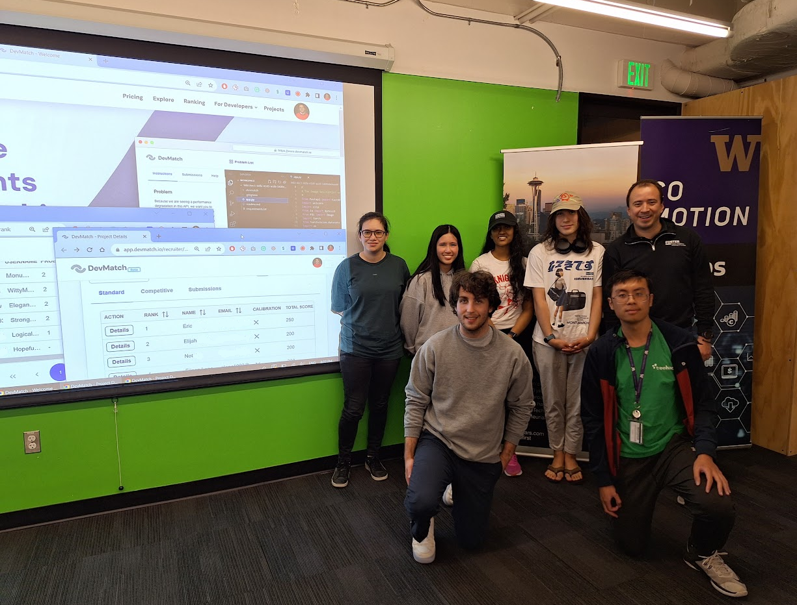
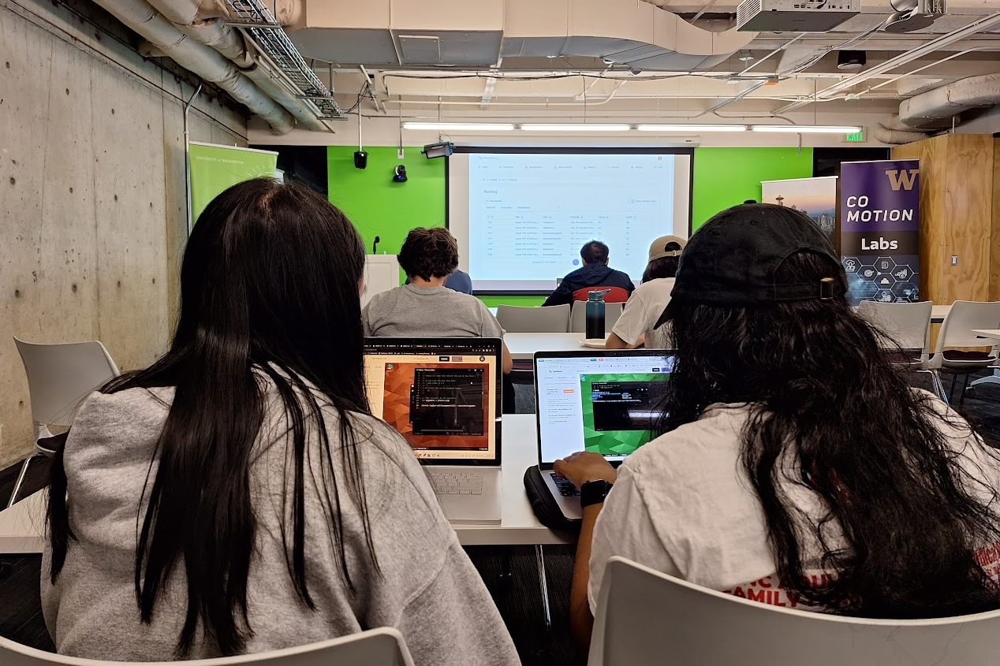

# August Coding Competition

A few months ago, we launched a new event to practice DevMatch problems in a hackathon-style competition. We rebranded these hackathons as coding competitions. During these monthly coding competitions, we select two or more problems from the DevMatch platform and compete against the clock to solve them in 2 hours or less. This week we had the August coding competition, and it was awesome! 

We changed to an eventing time and had people join us straight from their internships to work on these challenges. This was also the first time we tried out the super cool [daedalos](https://dustinbrett.com/) environment to solve challenges in the browser. We also had a brand new spring boot coding challenge.

We started the contest at 6:25, and barely halfway through, two contestants completed the two challenges! We had to add more coding challenges in the middle of the contest. This very competitive situation led us to find a problem with the ranking not reflecting the correct results, and it was also not automatically updated as it should. All fixed now!

Contestants are ranked according to the most problems solved, then by total time descending. The total time is the sum of the time consumed for each problem solved. The time consumed for a solved problem is the time elapsed from when the problem was open to submitting the first accepted run plus 20 penalty minutes for every previously rejected. There is no time consumed for a problem that is not solved.

In the end, contestants shared their solutions with the rest of the group and some of their struggles. This allowed participants to learn from one another by observing how others approach the same problem. We are happy that these competitions offer a platform for developers to solve real-world coding problems, test their skills, and compete with others. 

See you on the next one!

